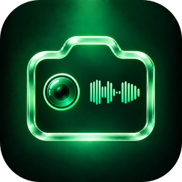
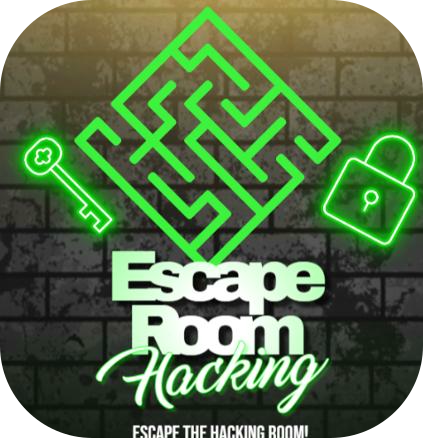
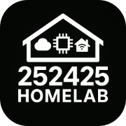
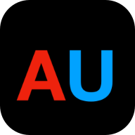
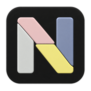
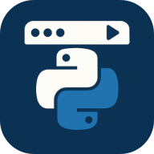
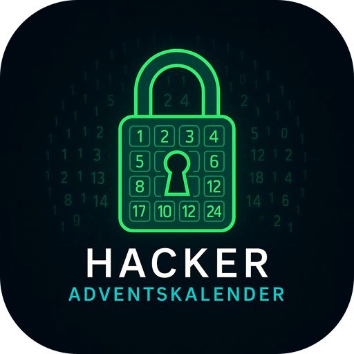

---

Passionate about technology, especially Apple, Linux, and AI. What started with a Raspberry Pi as a NAS has grown into a full Homelab — self-hosted services, local AI, and way too many side projects. I build tools I actually want to use, experiment with whatever seems interesting, and document the journey along the way.

I also run **[252425 HOMELAB](https://252425.xyz)**. I experiment with self-hosted services, networking, and whatever else seems worth breaking. Documented at **[blog.252425.xyz](https://blog.252425.xyz)**.

---

### 🚀 Projects

| | Project | Description |
|---|--------|-------------|
|  | [NarraCam](https://narracam.com) | A camera that describes before you capture — with speech output, local AI & a photo and video library |
|  | [Hacking Escape Room](https://hackingescaperoom.252425.xyz) | Interactive cybersecurity escape room experience |
|  | [252425 HOMELAB](https://252425.xyz) | Self-hosting, local AI, networking & hands-on projects from my homelab |
|  | [A-Ultra Website](https://a-ultra.com) | Official website for the A-Ultra YouTube channel |
|  | [AUltra Unified](https://huggingface.co/Anes-03/aultra-unified) | Experimental defensive cybersecurity & coding model, fine-tuned on Apple Silicon. [Dataset](https://huggingface.co/datasets/Anes-03/aultra-unified-training-data) · [Fine-tuning blog post](https://blog.252425.xyz/posts/zwei-fine-tuning-projekte-auf-einem-m4-mac-mini/) |
|  | [Neo Atelier](https://neo-atelier.252425.xyz) | Interactive MacBook Neo color & parts configurator — customize the case, components and individual keys with a live preview |
|  | [Markdown WebEditor](https://markdown-webeditor.252425.xyz) | Client-side Markdown editor with live preview, works offline |
|  | [LaunchSprint](https://launchsprint.252425.xyz) | Custom app launcher for macOS — fullscreen grid, folders & global hotkey |
|  | [MenuPy](https://menupy.252425.xyz) | Run Python scripts directly from the macOS menu bar |
|  | [Escape Room Dorian Gray](https://github.com/Anes-03/Escape-Room-The-Picture-of-Dorian-Gray) | Literary escape room based on The Picture of Dorian Gray |
|  | [Hacker Adventskalender 2025](https://adventskalender-2025.hackingescaperoom.tech) | Interactive advent calendar with 31 cybersecurity lessons & mini-games in a retro cyber style |

---

### 🛠️ Stack

---

### 📊 GitHub Stats

Always building, breaking, and learning something new.

---

### 🐍 Contribution Snake

<picture>
  <source media="(prefers-color-scheme: dark)" srcset="https://raw.githubusercontent.com/Anes-03/Anes-03/gh-pages/github-contribution-grid-snake-dark.svg">
  <source media="(prefers-color-scheme: light)" srcset="https://raw.githubusercontent.com/Anes-03/Anes-03/gh-pages/github-contribution-grid-snake.svg">
  
</picture>

---

### 🌐 Links

---

